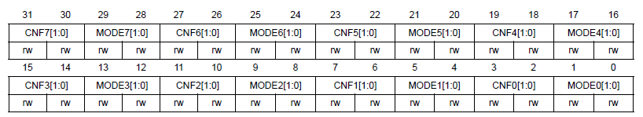
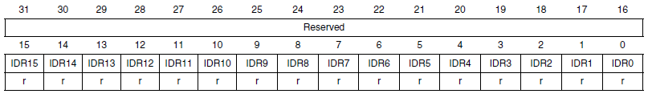
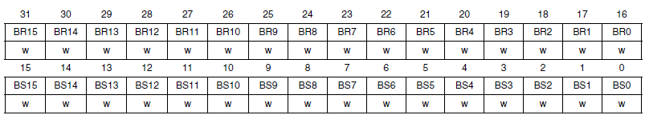

# Overview

This file describes STM32F103C6(or C8) GPIO configuration registers.

STM32F103 pins are grouped into ports named GPIOA, GPIOB, GPIOC. Each 
port can host up to 16 pins.

Pin could be worked as:
 - Input floating - digital input without pullup/pulldown resistors
 - Input pull-up - digital input with pullup resistor
 - Input pull-down - digital input with pulldown resistor
 - Analog - analog input
 - Output open-drain
 - Output push-pull
 - Alternate function push-pull
 - Alternate function open-drain

Before starting the setup, it is necessary to apply a clock signal to the bus of the required port.Than general purpose input output pins should be configured.

# GPIO configuration registers

GPIOx_CRL - Port pins 0-7 configuration
GPIOx_CRY - Port pins 8-15 configuration

MODEy[1:0] - gpio mode:
00 - input (default value)
01 - output with max switching frequency 10 Mhz
10 - output with max switching frequency 2 Mhz
11 - output with max switching frequency 50 Mhz

CNFy[1:0] - mode configuation

For MODEy[1:0] = 00:
 - 00: Analog mode
 - 01: Floating input
 - 10: Input with pull-up / pull-down. ODR register bit set to 1 pullup, 0 - pulldown 
 - 11: Reserved  

For MODEy[1:0]>00:
00: General purpose output push-pull
01: General purpose output Open-drain
10: Alternate function output Push-pull
11: Alternate function output Open-drain 

# Read and write registers

GPIOx_IDR - pins input value

GPIOx_ODR - pins output value

Set GPIOx_ODR bits is not atomic operation and assumes to operations: 
read ODR and set ODR bits. This is a reason to use another 
two registers GPIOx_BSRR and GPIOx_BRR.

GPIOx_BSRR - atomic set or clear ODR bits

